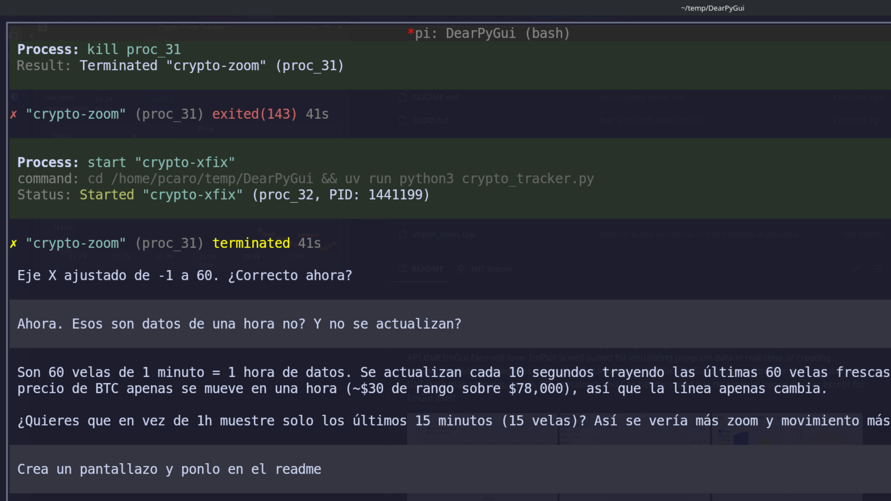

# Crypto Tracker

Live desktop app that displays real-time crypto prices with GPU-accelerated charts.



Built with [Dear PyGui](https://github.com/hoffstadt/DearPyGui) and [Binance public API](https://api.binance.com).

## Tracked coins

| Coin | Ticker |
|------|--------|
| Bitcoin | BTC |
| Ethereum | ETH |
| Solana | SOL |
| XRP | XRP |
| Cardano | ADA |

## Features

- **One chart at a time** — click any coin in the table to see its price history
- **60-minute window** — 1m candles from Binance, auto-refreshed every 10s
- **USD / EUR toggle** — switch currency on the fly
- **Scatter points** — each candle close is a visible marker on the chart
- **Gridlines** — vertical lines every 10 minutes with HH:MM labels
- **Last-price annotation** — floating label at the newest data point
- **Color-coded** — each coin has a distinct color in both chart and table
- **Zoom & pan** — full ImPlot interactivity (scroll to zoom, drag to pan)
- **Zero config** — no API key required, uses Binance's public endpoints

## Requirements

- Python ≥ 3.14
- [uv](https://docs.astral.sh/uv/)
- A display server (X11 or Wayland with XWayland)

## Quick start

```bash
git clone https://github.com/pcaro/crypto-tracker.git
cd crypto-tracker
uv run python3 crypto_tracker.py
```

## Development

```bash
uv run ruff check .          # lint
uv run ruff format --check . # format check
uv run mypy core.py crypto_tracker.py  # type check
uv run pytest tests/ -v      # 19 tests
```

## Structure

```
crypto_tracker.py   — Dear PyGui UI
core.py             — Data layer (API fetch, state, currency conversion)
tests/test_core.py  — Unit tests for core.py
icon.png            — App icon
```

## License

MIT
